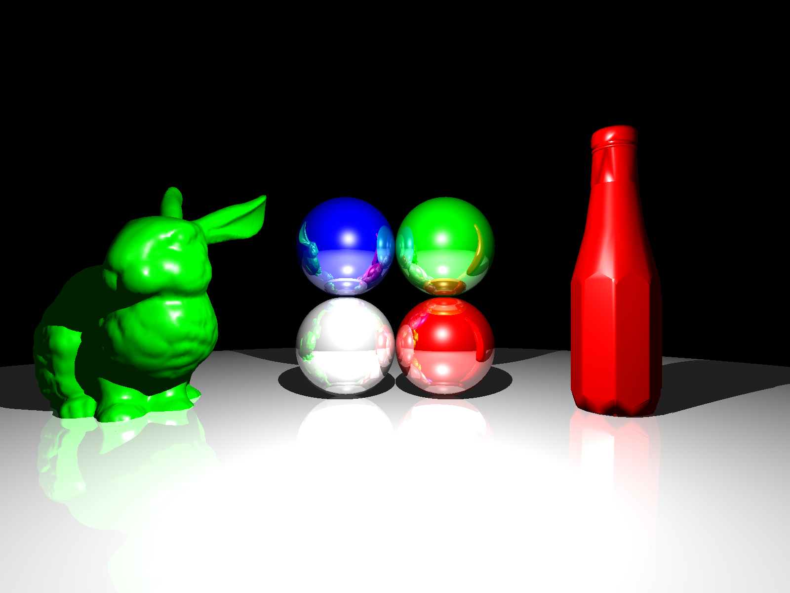
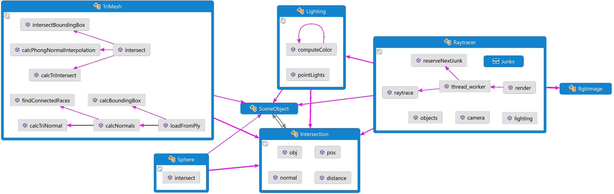

# A basic raytracing rendering program
This is a basic raytracing program written in C++11 as a homework assignment for the **Computer Animation and Data Visualization** course at Shanghai Jiao Tong University, Fall semester 2017. [Link to the course](http://www.cs.sjtu.edu.cn/~shengbin/course/datavis/index.htm)

The program only takes the scene geometry, light, materials and camera pose as an input to generate a photorealistic image of the scene using the raytracing algorithm.

This is the result of a complex scene including the **Stanford bunny** with normal interpolation, a bottle of ketchup and 4 reflective spheres.
More examples can be found in the `images/` subfolder.


## How to build the project
Its dependencies are *OpenCV* (Version 3.31) for displaying and saving images, *Eigen* (Version 3.34), a template library for Linear Algebra and *cmake* as build system.
For the steps below the system needs to have `cmake` installed.
1. Install OpenCV3. Commonly OpenCV will be linked dynamically. Make sure the Environment variable OpenCV_Dir is set.
For example if you build OpenCV from source under Windows with Visual Studio that path is `$(Path-to-OpenCV-folder)/build/install`.
Under Windows also make sure the OpenCV-binaries are found in the PATH environment variable.
If you build from source this may be for example: `$(Path-to-OpenCV-folder)/build/install/x64/vc14/bin`.
2. Install *Eigen3* with cmake. [Instructions for Windows, see below](#install-eigen-with-cmake-on-windows). 
3. Clone the repository and cd into it.
4. Create a build folder:  
```
mkdir build
cd build
```

5. **Windows only**
Set the correct cmd environment before using cmake. For example if you use Visual Studio 2014 run the the 'VS2015 x64 Native Tools Command Prompt' or run:
```
%comspec% /k ""C:\Program Files (x86)\Microsoft Visual Studio 14.0\VC\vcvarsall.bat"" amd64
```

Then cd into your build folder.

6. Run cmake, *optionally* set the generator needed on your system
```
cmake -G "$(select-your-code-generator)" ../src
```
For example on Visual Studio 2014 you would run
```
cmake -G "Visual Studio 14 2015 Win64" ../src`.
```
For QtCreator **under Windows** the `NMake Makefiles` generator works. (Because I did not succeed by directly opening the `CMakeLists.txt` under Windows.)

7. Open the project files generated by cmake in your *IDE*. If you just want to test the project, build using the *Release* settings or enable code optimizations to obtain a fast performance.
*Or* build the project directly:
```
cmake --build .
```
You should now have a `Raytracer` or `Raytracer.exe` executable in your build folder.

8. Download the models to run the demo application. You need `ketchup.ply` from <http://people.sc.fsu.edu/~jburkardt/data/ply/ketchup.ply> and the *Stanford Bunny* from the [Stanford 3D Scanning Repository](http://graphics.stanford.edu/pub/3Dscanrep/bunny.tar.gz). The demo looks for the filepath `models/bunny/reconstruction/bun_zipper.ply`.

### Install Eigen with cmake on Windows
To install Eigen as a cmake module on Windows, follow these steps:
1. Clone the repository
```
git clone https://github.com/eigenteam/eigen-git-mirror.git`
cd eigen-git-mirror
```

2. (Optionally) checkout branch Version 3.3

```
git checkout branches/3.3
```
3. Create new folders
```
mkdir build
mkdir build/install
```
4. Run cmake
```
cmake -DCMAKE_INSTALL_PREFIX="%cd%\install"
```
5. Install
```
cmake --build . --target INSTALL
```
6. Add to path to environment variables
```
setx Eigen3_DIR "%cd%\install\share\eigen3\cmake"
```
## Overview of the implemented features
1. Supported scene objects

The program supports two different object primitives: Spheres and Triangles.
Complex objects can be loaded as a mesh of triangles.
Therefore a parser for ASCII Stanford-PLY files was implemented.

2. Phong shading

Realistic illumination is simulated using the phong shading model.
For the color of each pixel an ambient, diffuse and specular component is calculated.
The result is determined by the individual material values of the affected object, i.e. its reflection coefficients.

3. Recursive reflection

If the material of an object is reflective, coherent reflection is simulated.
This is achieved by recursively applying the Phong shading illumination model at the origin of the incoming reflected ray.
By default the reflective rays are restricted to a depth of 3.

4. Phong normal interpolation

To obtain a smooth shading result for polygon meshes, phong normal interpolation is implemented.
First the normal of each face is calculated.
Then for each vertex a normal vector is calculated by averaging the normal vectors of the connected triangles, weighted by their area. 
Finally when calculating the illumination at a point inside a triangle, the barycentric average of the normal vectors of its vertices is used as a normal vector for Phong shading.

5. Multithreading and parallelization

To exploit multicore processors raytracing can be performed in an arbitrary number of threads, one thread per available processore core is recommended.
The image is divided into small 50x50 square images.
The queue of square images is then processed in parallel, one square per thread.

6. Display and export of the result

After finishing the raytracing rendering the generated image is displayed in a window and saved as a PNG-file in the original resolution.

## Implementation overview

In the diagram above the rendering pipeline of the Raytracer class and its most important functions are illustrated.
The rendering is invoked by the *render()* function and the output is an RgbImage.
The *raytrace()* function is called in parallel on different 50x50 subimages.
For each pixel it calculates a ray, looks for an intersection with a scene object and invokes the *computeColor()* function of the *Lighting* class.
This function simulates the illumination using the **Phong shading model** and calls itself recursively in the case of a coherent reflection.
*SceneObject* is a abstract virtual class providing the necessary interfaces, e.g. the *intersect()* function, for different geometry primitives. 
Thus the program can be easily extended with additional objects that are not yet included.
So far the *Sphere*-class and *TriMesh*-class have been implmented, both inherit from *SceneObject*.
The *TriMesh*-class represents a mesh of triangle surfaces.
It supports importing complex objects from *Stanford-PLY* files using the static *loadFromPly()* function.
After loading an object, the function calculates all the normals necessary to perform **Phong normal interpolation** quickly during the rendering step.
In order to accelerate rendering a bounding box is calculated for each object. Hence the time-intensive calculation of an (impossible) intersection for all the triangles is avoided.
